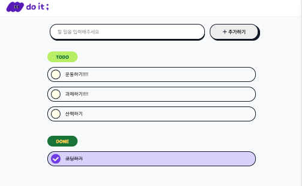

# Todo List

<h4>할 일 목록을 관리하는 To Do 웹페이지입니다. <a href="https://next-todo-seven-theta.vercel.app" target="_blank">[demo]</a></h4>

## 기능

- 할 일 목록 조회
    - 진행 중인 할일과 완료된 할 일을 확인할 수 있습니다.
- 할 일 상세보기 조회
- 할 일 상세보기 추가 수정, 삭제
    - 메모, 사진을 추가할 수 있습니다.

## 실행 방법

1. 리포지토리 클론
2. `pnpm install` 명령어 실행
3. .env.local 파일 추가 (required: NEXT_PUBLIC_API_KEY, NEXT_PUBLIC_TENANT_ID)
4. `pnpm run start` 명령어 실행